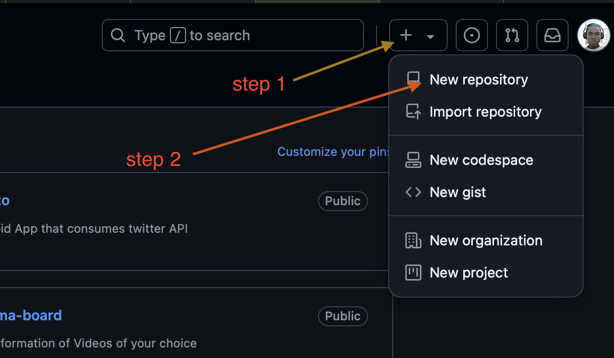

# greenwood-library-website
Greenwood Community Library is a website that aims at engaging and informing visitors

## Activities

### Step 1 - Create a new repository

To start this project, I created a repository on the [github website](http://github.com). You must have a github account to be able to do that. The images below shows a screenshot of the steps taken.

| Create Repository | Provide Repo details | Copy Repo Url |
|    :----------:     |      :----------:      |   :----------:   |
|  |  |  |

### Step 2 - Clone the repository

After that, I opened my terminal, and navigated to my `darey-training` repository, where I have another repository for `git-project`. While in the repository, I cloned the project using 
>`git clone git@github.com:jesmanto/greenwood-library-website.git`

See the image belows

| Directory navigation | Clone project | 
|    :----------:     |      :----------:      |
|  |  | 

>Use `code .` to open the project in Visual Studio code

### Step 3 - Create the project files in main branch

The files can be created either by using the VScode user interface or by using the terminal. The terminal was used in this project, leveraging the `vim` and `touch` commands.

The following files were created in the main branch

* [home.html](./home.html)
* [about_us.html](./about_us.html)
* [events.html](./events.html)
* [contact_us.html](./contact_us.html)

The image below shows the creation of the files using `vim` and `touch` commands on the terminal.

Once the files are successfully created with random data added to them, it's now time to stage and commit the changes.
- `git add .` command was used to stage all the changes
- `git commit -m "message"` command was used to commit the changes

- Finally, the changes were pushed to the remote repository using `git push` command

### Step 4 - Morgans Work
- Create and checkout to a new branch called `add-book-reviews`.
> use `git checkout -b add-book-reviews`
- Create the [book_reviews.html](./book_reviews.html) file using the command below

> `vim book_reviews.html` or `touch book_reviews.html`

- Stage the changes
>`git add .`

- Commit the staged changes
>`git commit -m "Add book reviews section"`

- Push to remote branch
>`git push origin add-book-reviews`

- Raise a PR for Morgan's work
- Merge Morgan's work

### Step 5 - Jamie's Work
- Create and checkout to a new branch called `update_events`
> use `git checkout -b update_events`
- Pull the latest changes from the main branch
> use `git pull origin main`
- Open the [events.html](./events.html) file and make the necessary changes. This can either be done using a linux code editor like Vim or GUI editor like VSCode. to do that on the terminal
> use `vim events.html`

- Stage the changes
>`git add .`

- Commit the staged changes
>`git commit -m "Events page was updated"`

- Push to remote branch
>`git push origin update-events`

- Raise a PR for Jamie's work
- Merge Jamie's work